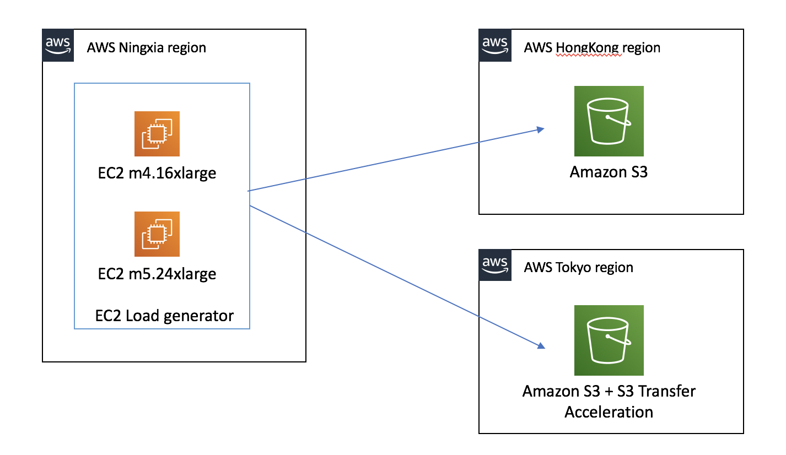
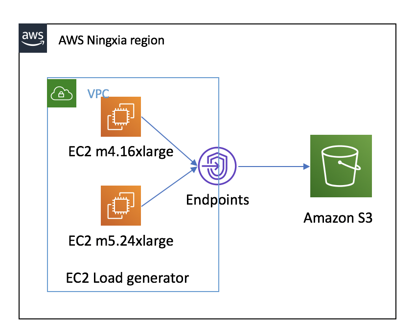

# S3 performance testing

**Testing scenario 1: From AWS Ningxia region EC2 to AWS Hongkong region S3 bucket and AWS Tokyo region S3 bucket**

**Testing scenario 2: From AWS Ningxia region EC2 to AWS Ningxia region S3 bucket**

## Preparation
1. Create EC2 on AWS Ningxia region
- m5.24xlarge 96vCPU, 284GiB RAM, 1TB gp2 SSD, 25Gbps network bandwidth
- m4.16xlarge 64vCPU, 256GiB RAM, 1TB gp2 SSD, 25Gbps network bandwidth

2. Enable BBR to improve transfer performance
https://aws.amazon.com/amazon-linux-ami/2017.09-release-notes/

3. create s3 bucket
AWS Hongkong region: molex-mess-migration-hk
AWS Tokyo region: molex-mess-migration-tokyo

4. Read the S3 Performance Guidelines and Design Patterns
[Optimizing Amazon S3 Performance](https://docs.aws.amazon.com/AmazonS3/latest/dev/optimizing-performance.html)

## Testing utility and test case
- aws s3 cli
1. [EC2 and S3 in different region: Testing mixed upload and download with AWS S3 CLI](AWS-S3-CLI.md)
2. [EC2 and S3 in different region: Enable S3 Transfer Acceleration testing](Enable-S3-Transfer-Acceleration.md)
3. [EC2 and S3 in same region: Testing mixed upload and download with AWS S3 CLI] TBD - Coming soon

- 3rd party tools
1. [Cross-Region: Download benchmark by dvassallo/s3-benchmark](dvassallo-s3-benchmark.md) 
2. [Cross-Region: Benchmark by christianbaun/ossperf](christianbaun-ossperf.md)

## Conclusion

From the testing, spreading requests over separate connections is good choice to maximize the accessible bandwidth from Amazon S3. We saw that multiple threads parallel streams and enabled multipart uploads can improve performance dratically. We also demonstrated how to use Amazon S3 Transfer Acceleration to Minimize Latency Caused by Distance

When using the AWS CLI for Amazon S3 to upload files to Amazon S3 from a single instance, the limiting factors are end-to-end networking bandwidth to the AWS S3 endpoint for large files transfering and host CPU when sending many small files. 

The testing data transfer is Internet based, depending on your particular environment, the speed and throuhput can be different consider the connection stablization.

To optimize performance, we recommend that you access the bucket from Amazon EC2 instances in the same AWS Region when possible. 

The utility multiple threads setting should based on your transfer file size and your host performance, from the testing scenario in this repository, default.s3.max_concurrent_requests 100 is wisely choice.

Synchronizing (aws s3 sync) can be much faster than creating a new copy of the data in many cases (aws s3 cp).

## Further consideration
1. If you need serverless or breaking-point resume supported. You can consider use [Amazon S3 MultiThread Resume Migration Solution](https://github.com/aws-samples/amazon-s3-resumable-upload)
* Breaking-point resume supported, suitable for mass files transimission to Amazon S3

2. If you upload file from on-primse server to S3, you can consider the AWS Direct Connect
* AWS Direct Connect provide stable data transfer connection
* Single 10Gbps AWS Direct Connect can transfer 108TB per day
* Group 4 x 10Gbps AWS Direct Connect as one LAG to provide 40Gbps bandwidth.

